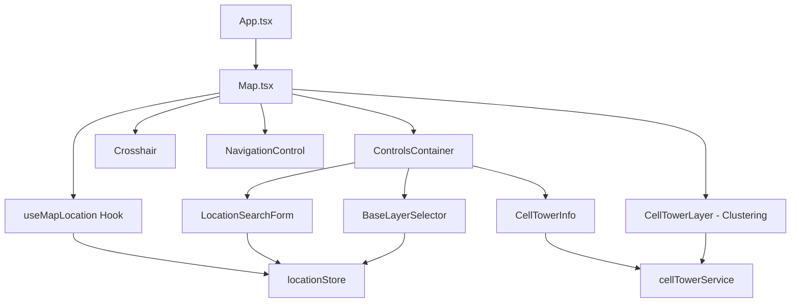
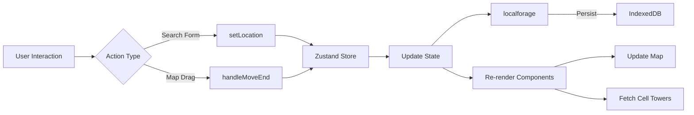
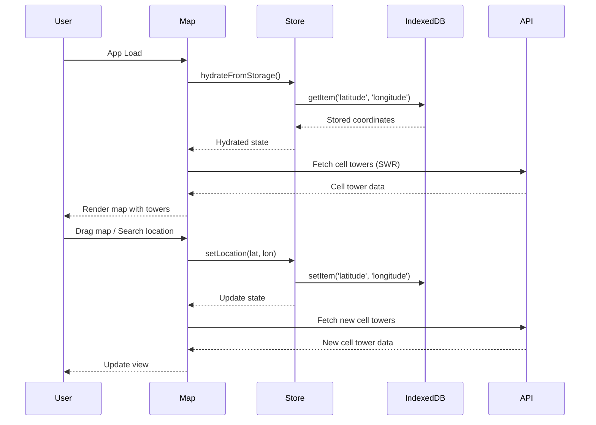

# MapLibre GL Experiment

A React + TypeScript application for exploring MapLibre GL mapping capabilities with cell tower visualization featuring intelligent clustering, persistent location state, and comprehensive test coverage.

## Features

### 🗺️ Interactive Mapping

- **Multiple Base Layers**: Switch between Street, Satellite, and Hybrid map views
   - Street: OpenStreetMap tiles with detailed street information
   - Satellite: EOX Sentinel-2 cloudless satellite imagery
   - Hybrid: Satellite imagery with street overlay
- **Layer Control Panel**: Glass morphism UI control panel for seamless layer switching
- **Persistent Layer Selection**: Selected base layer persists across sessions via IndexedDB
- **Navigation Controls**: Built-in zoom and rotation controls for easy map manipulation
- **Smooth Animations**: Animated transitions when flying to new locations
- **Drag & Pan**: Interactive map dragging with automatic location updates
- **Crosshair Marker**: Pulsating visual center indicator appears during map dragging to show precise map center positioning
- **Real-time Coordinate Display**: Popup showing live latitude/longitude updates as you drag the map, positioned at the bottom-right of the crosshair

### 📡 Cell Tower Visualization

- **Real-time Data Fetching**: Fetches cell tower data from OpenCelliD API using SWR for efficient data management
- **Smart Caching**: Automatic caching and revalidation of cell tower data
- **Intelligent Clustering**: MapLibre native clustering automatically groups nearby towers
  - **Zoom-responsive**: Clusters break apart progressively as you zoom in
  - **Visual Density Indicators**: Cluster size and color represent tower count
    - Small clusters (1-10 towers): 20px blue circles
    - Medium clusters (10-30 towers): 30px yellow circles
    - Large clusters (30+ towers): 40px pink circles
  - **Count Labels**: Clear numeric labels show exact tower count in each cluster
  - **Individual Markers**: Red circular markers appear at zoom level 14+ or for isolated towers
- **Coverage Radius**: Displays towers within a 0.9km radius (1.8km × 1.8km search box)
- **Tower Information**: Each marker contains cell tower metadata (cellid, radio type, MCC, MNC, range)
- **Performance Optimized**: Native MapLibre clustering handles thousands of towers efficiently

### 🔍 Location Search

- **Coordinate Input**: Search for any location using latitude/longitude coordinates
- **Input Validation**: Real-time validation ensuring coordinates are within valid ranges
   - Latitude: -90 to 90
   - Longitude: -180 to 180
- **Glass Morphism UI**: Translucent frosted glass background with backdrop blur for modern aesthetics
- **Interactive Button Feedback**:
   - Blue pulsating glow effect on hover
   - Green success transition (800ms) when search is submitted
   - Visual feedback only triggers on valid submissions
- **Form Feedback**: User-friendly error messages for invalid inputs
- **Auto-sync**: Input fields automatically update when map is dragged
- **Collapsible Accordion**: Expandable/collapsible form to maximize map viewing area

### 💾 Persistent State Management

- **IndexedDB Storage**: Location and map style preferences persisted using localforage with IndexedDB backend
- **State Hydration**: Automatically restores last viewed location and selected base layer on app reload
- **Zustand Store**: Centralized state management with reactive updates
- **Automatic Persistence**: Location and layer selection changes automatically saved to browser storage

### 📊 Status Indicators

- **Loading States**: Visual feedback during data fetching
- **Error Handling**: Clear error messages when data fetching fails
- **Tower Count**: Real-time display of loaded cell towers in the location search panel
- **Multi-state Support**: Simultaneous display of loading and error states when applicable

### 🏗️ Architecture & Code Quality

#### Component Structure

The application is organized into modular, reusable components:



#### State Management Architecture



#### Data Flow



### 🧪 Testing

Comprehensive test suite with **100% code coverage**:

- **100 passing tests** across 10 test files
- **Unit tests** for all components, hooks, and stores
- **Mocked dependencies** (localforage, MapLibre GL)
- **User interaction testing** with Testing Library
- **Fake timer testing** for animated UI state transitions
- **Clustering tests** verifying MapLibre configuration and multi-layer rendering
- **Coverage reporting** in text, JSON, and HTML formats

#### Test Coverage

| Component           | Tests    | Coverage |
| ------------------- | -------- | -------- |
| locationStore       | 13 tests | 100%     |
| useMapLocation      | 12 tests | 100%     |
| LocationSearchForm  | 13 tests | 100%     |
| BaseLayerControl    | 11 tests | 100%     |
| BaseLayerSelector   | 10 tests | 100%     |
| ControlsContainer   | 8 tests  | 100%     |
| CellTowerInfo       | 9 tests  | 100%     |
| CellTowerLayer      | 8 tests  | 100%     |
| MapStatusIndicators | 10 tests | 100%     |
| Crosshair           | 6 tests  | 100%     |

### 🎭 End-to-End Testing

Comprehensive acceptance testing with Playwright and Cucumber.js:

- **BDD-style scenarios** using Gherkin syntax for readable test specifications
- **Cross-browser testing** (Chromium, Firefox, WebKit) ensuring compatibility across all major browsers
- **User journey coverage**: Complete testing of map navigation, location search, drag interactions, and cell tower visualization
- **Automatic screenshots** on test failure for debugging
- **Dev server automation**: Automatically starts and stops dev server for each test run
- **Located in**: `e2e/` directory with organized structure:
  - `features/`: Gherkin feature files defining test scenarios
  - `steps/`: Step definitions implementing test logic
  - `support/`: Test hooks, world configuration, and dev server management

#### Test Scenarios

**Map Navigation** (`e2e/features/map-navigation.feature`):
- View default map location (Shakopee, MN)
- Search for locations using latitude/longitude coordinates
- Drag map with pulsating crosshair and real-time coordinate display
- Zoom in/out while maintaining stable map center
- Switch between base layers (Street, Satellite, Hybrid) with visual confirmation

**Cell Tower Visualization** (`e2e/features/cell-towers.feature`):
- View cell tower markers on initial load
- Update cell towers when location changes
- Display loading states and tower count indicators
- Verify cell tower data persistence across location changes

#### Running E2E Tests

```bash
# First time setup - install browsers
npm run playwright:install

# Run tests in headless mode (CI/CD)
npm run test:e2e

# Run tests with browser UI for debugging
npm run test:e2e:headed

# Test reports and screenshots saved to e2e/reports/
```

## Tech Stack

### Core

- **React 19.2.0** - UI library
- **TypeScript** - Type safety
- **Vite (rolldown-vite 7.2.5)** - Build tool using Rust-powered bundler

### Mapping

- **MapLibre GL 5.13.0** - Open-source mapping library
- **@vis.gl/react-maplibre 8.1.0** - React bindings for MapLibre

### State Management & Data Fetching

- **Zustand 5.0.8** - Lightweight state management
- **SWR 2.3.6** - Data fetching and caching
- **localforage 1.10.0** - IndexedDB abstraction for persistence

### Styling

- **Tailwind CSS 4.1.17** - Utility-first CSS framework
- **@tailwindcss/postcss 4.1.17** - PostCSS integration

### Testing

#### Unit Testing

- **Vitest 4.0.9** - Fast unit test framework
- **@testing-library/react 16.3.0** - React component testing utilities
- **@testing-library/user-event 14.6.1** - User interaction simulation
- **@vitest/coverage-v8** - Code coverage reporting
- **jsdom** - DOM implementation for Node.js

#### E2E Testing

- **Playwright 1.56.1** - Browser automation and testing
- **Cucumber.js 12.2.0** - BDD test framework with Gherkin syntax
- **ts-node 10.9.2** - TypeScript execution for test files

### Code Quality

- **ESLint 9.39.1** - Linting
- **Prettier 3.6.2** - Code formatting
- **TypeScript 5.9.3** - Static type checking

## Project Structure

```
src/
├── components/
│   ├── Map.tsx                    # Main map container
│   └── map/
│       ├── BaseLayerControl.tsx   # [Deprecated] Base layer switcher
│       ├── BaseLayerSelector.tsx  # Layer switcher component (modular)
│       ├── CellTowerInfo.tsx      # Cell tower count display with states
│       ├── CellTowerLayer.tsx     # Cell tower visualization with clustering
│       ├── ControlsContainer.tsx  # Accordion container for map controls
│       ├── Crosshair.tsx          # Crosshair marker for drag positioning
│       ├── LocationSearchForm.tsx # Coordinate search form (refactored)
│       └── MapStatusIndicators.tsx # [Deprecated] Status indicators
├── hooks/
│   └── useMapLocation.ts          # Custom hook for map interactions & drag state
├── stores/
│   └── locationStore.ts           # Zustand store with IndexedDB persistence
├── services/
│   └── cellTowerService.ts        # SWR-based data fetching
├── config/
│   └── mapStyles.ts               # Map style configurations (street, satellite, hybrid)
└── test/
    └── setup.ts                   # Test environment configuration
```

## Getting Started

### Installation

```bash
npm install
```

### Development

```bash
npm run dev          # Start development server with HMR
npm run preview      # Preview production build locally
```

### Building

```bash
npm run build        # Type-check with tsc and build for production
```

### Testing

#### Unit Tests (Vitest)

```bash
npm run test              # Run unit tests in watch mode
npm run test:ui           # Run unit tests with UI
npm run test:coverage     # Run unit tests with coverage report
```

#### E2E Tests (Playwright + Cucumber)

```bash
npm run playwright:install   # Install Playwright browsers (first time only)
npm run test:e2e             # Run E2E tests in headless mode
npm run test:e2e:headed      # Run E2E tests with browser UI
```

### Code Quality

```bash
npm run lint              # Run ESLint
npm run format            # Format code with Prettier
npm run format:check      # Check code formatting
```

## Configuration

### Environment Variables

The application uses environment-specific configurations:

- Default location: Shakopee, MN (44.7975, -93.5272)
- Cell tower search radius: 0.9km
- Cell tower limit per request: 50 towers

### Map Configuration

Satellite imagery provided by:

- **Source**: EOX Sentinel-2 cloudless 2020
- **License**: [EOX IT Services GmbH](https://eox.at/)
- **Attribution**: [Sentinel-2 cloudless](https://s2maps.eu)

### Storage Configuration

Location and map preferences are persisted to IndexedDB with the following schema:

- **Database**: `maplibre-experiment`
- **Store**: `location`
- **Keys**: `latitude`, `longitude`, `baseLayer`

## API Integration

### OpenCelliD API

The application fetches cell tower data from the OpenCelliD API:

- **Endpoint**: `https://opencellid.org/cell/getInArea`
- **Parameters**:
   - `lat`: Latitude
   - `lon`: Longitude
   - `radius`: Search radius in kilometers
   - `limit`: Maximum number of towers to return
- **Rate Limits**: Area search limited to 4,000,000 sq.m (4 km²)

## Browser Support

- Modern browsers with ES2022 support
- IndexedDB support required for persistence
- WebGL support required for MapLibre GL

## Future Enhancements

Potential areas for expansion:

- [x] Multiple map layer support (street, satellite, hybrid) ✅
- [x] Intelligent marker clustering with zoom-responsive behavior ✅
- [ ] Additional map styles (terrain, topographic)
- [ ] Cell tower filtering by radio type (LTE, 5G, GSM, etc.)
- [ ] Distance measurement tools
- [ ] Export/import saved locations
- [ ] Offline map support
- [ ] Cluster expansion on click (zoom into cluster)
- [ ] Tower detail popups on click
- [ ] Drawing tools for custom areas
- [ ] Heatmap visualization as alternative to clustering

## License

This is an experimental project for learning and demonstration purposes.

## Acknowledgments

- [MapLibre GL](https://maplibre.org/) for the open-source mapping library
- [OpenCelliD](https://opencellid.org/) for providing cell tower data
- [EOX IT Services](https://eox.at/) for satellite imagery
- [Sentinel-2 cloudless](https://s2maps.eu) for beautiful satellite maps
