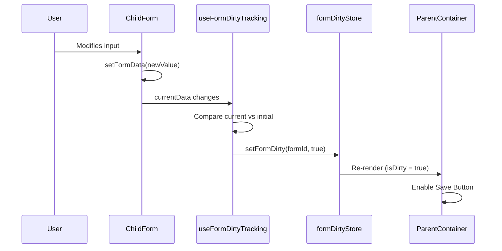

# IMPL-001: Dirty State Management

## Overview

This implementation plan covers the dirty state tracking system that monitors form modifications across multiple child
forms. The parent container aggregates dirty state from all children to control the global save button.

## Related Feature

- **Feature**: [FEATURE-001: Multi-Form Save with Coordinated Validation](../features/FEATURE-001.md)
- **Acceptance Criteria**: AC1.1 - AC1.5

## Prerequisites

- React 19 with TypeScript configured
- Zustand installed for state management
- Basic project structure in place

---

## Implementation Steps

### Step 1: Define TypeScript Types

Create type definitions for dirty state tracking.

**File**: `src/types/form.types.ts`

```typescript
export interface DirtyStateMap {
    [formId: string]: boolean;
}

export interface FormDirtyState {
    dirtyForms: Set<string>;
    isDirty: boolean;
    setFormDirty: (formId: string, dirty: boolean) => void;
    resetDirtyState: () => void;
}
```

### Step 2: Create Zustand Store for Dirty State

Implement a Zustand store to manage dirty state across forms.

**File**: `src/stores/formDirtyStore.ts`

```typescript
import {create} from 'zustand';

interface FormDirtyState {
    dirtyForms: Set<string>;
    setFormDirty: (formId: string, dirty: boolean) => void;
    resetDirtyState: () => void;
    isDirty: () => boolean;
}

export const useFormDirtyStore = create<FormDirtyState>((set, get) => ({
    dirtyForms: new Set<string>(),

    setFormDirty: (formId: string, dirty: boolean) => {
        set((state) => {
            const next = new Set(state.dirtyForms);
            if (dirty) {
                next.add(formId);
            } else {
                next.delete(formId);
            }
            return {dirtyForms: next};
        });
    },

    resetDirtyState: () => {
        set({dirtyForms: new Set<string>()});
    },

    isDirty: () => {
        return get().dirtyForms.size > 0;
    },
}));
```

### Step 3: Create Custom Hook for Form Dirty Tracking

Create a reusable hook that child forms use to track their dirty state.

**File**: `src/hooks/useFormDirtyTracking.ts`

```typescript
import {useEffect, useRef, useCallback} from 'react';
import {useFormDirtyStore} from '../stores/formDirtyStore';

interface UseFormDirtyTrackingOptions<T> {
    formId: string;
    currentData: T;
    initialData: T;
    compareFunction?: (current: T, initial: T) => boolean;
}

export function useFormDirtyTracking<T>({
                                            formId,
                                            currentData,
                                            initialData,
                                            compareFunction,
                                        }: UseFormDirtyTrackingOptions<T>) {
    const setFormDirty = useFormDirtyStore((state) => state.setFormDirty);
    const previousDirtyRef = useRef<boolean>(false);

    // Default comparison using JSON stringify
    const defaultCompare = useCallback(
        (current: T, initial: T) => JSON.stringify(current) !== JSON.stringify(initial),
        []
    );

    const compare = compareFunction ?? defaultCompare;

    useEffect(() => {
        const isDirty = compare(currentData, initialData);

        // Only update store if dirty state changed
        if (isDirty !== previousDirtyRef.current) {
            previousDirtyRef.current = isDirty;
            setFormDirty(formId, isDirty);
        }
    }, [formId, currentData, initialData, compare, setFormDirty]);

    // Cleanup: mark form as not dirty when unmounting
    useEffect(() => {
        return () => {
            setFormDirty(formId, false);
        };
    }, [formId, setFormDirty]);

    return previousDirtyRef.current;
}
```

### Step 4: Integrate Dirty Tracking in Child Forms

Update child form components to use the dirty tracking hook.

**File**: `src/components/ChildFormA.tsx` (example)

```tsx
import {useState} from 'react';
import {useFormDirtyTracking} from '../hooks/useFormDirtyTracking';

interface FormAData {
    name: string;
    email: string;
}

const INITIAL_DATA: FormAData = {name: '', email: ''};

export function ChildFormA() {
    const [formData, setFormData] = useState<FormAData>(INITIAL_DATA);

    // Track dirty state
    const isDirty = useFormDirtyTracking({
        formId: 'formA',
        currentData: formData,
        initialData: INITIAL_DATA,
    });

    return (
        <div className="child-form">
            <h2>User
                Information
                {
                    isDirty && <span className="dirty-indicator"> * </span>}</
                h2>
            {/* Form fields */}
        < /div>
    );
}
```

### Step 5: Connect Save Button to Dirty State

Update the parent container to read dirty state from the store.

**File**: `src/components/ParentContainer.tsx`

```tsx
import {useFormDirtyStore} from '../stores/formDirtyStore';

export function ParentContainer() {
    const isDirty = useFormDirtyStore((state) => state.dirtyForms.size > 0);
    const dirtyForms = useFormDirtyStore((state) => state.dirtyForms);

    return (
        <div className="parent-container">
            <header>
                <button disabled={!
                    isDirty
                }
                        className="save-button">
                    Save
                    All
                    Changes
                < /button>
            < /header>
            {/* Child forms */
            }
        </div>
    );
}
```

---

## Data Flow Diagram



---

## Acceptance Criteria

| ID    | Criterion                                                                               | Validation                                                           |
|-------|-----------------------------------------------------------------------------------------|----------------------------------------------------------------------|
| AC1.1 | When a child form input is modified from its initial value, the form is marked as dirty | Verify `dirtyForms` contains the formId after modification           |
| AC1.2 | When a child form input is reverted to its initial value, the form is no longer dirty   | Verify formId is removed from `dirtyForms` when values match initial |
| AC1.3 | The parent container correctly tracks which forms are dirty                             | Verify `dirtyForms` Set contains correct formIds                     |
| AC1.4 | The global save button is disabled when no forms are dirty                              | Verify button has `disabled` attribute when `dirtyForms.size === 0`  |
| AC1.5 | The global save button is enabled when at least one form is dirty                       | Verify button is clickable when `dirtyForms.size > 0`                |

---

## Unit Tests

**File**: `src/stores/formDirtyStore.test.ts`

```typescript
import {describe, it, expect, beforeEach} from 'vitest';
import {useFormDirtyStore} from './formDirtyStore';

describe('formDirtyStore', () => {
    beforeEach(() => {
        useFormDirtyStore.getState().resetDirtyState();
    });

    it('should start with no dirty forms', () => {
        const {dirtyForms} = useFormDirtyStore.getState();
        expect(dirtyForms.size).toBe(0);
    });

    it('should mark a form as dirty', () => {
        useFormDirtyStore.getState().setFormDirty('formA', true);
        const {dirtyForms} = useFormDirtyStore.getState();
        expect(dirtyForms.has('formA')).toBe(true);
    });

    it('should mark a form as not dirty', () => {
        useFormDirtyStore.getState().setFormDirty('formA', true);
        useFormDirtyStore.getState().setFormDirty('formA', false);
        const {dirtyForms} = useFormDirtyStore.getState();
        expect(dirtyForms.has('formA')).toBe(false);
    });

    it('should track multiple dirty forms', () => {
        useFormDirtyStore.getState().setFormDirty('formA', true);
        useFormDirtyStore.getState().setFormDirty('formB', true);
        const {dirtyForms} = useFormDirtyStore.getState();
        expect(dirtyForms.size).toBe(2);
    });

    it('should reset all dirty state', () => {
        useFormDirtyStore.getState().setFormDirty('formA', true);
        useFormDirtyStore.getState().setFormDirty('formB', true);
        useFormDirtyStore.getState().resetDirtyState();
        const {dirtyForms} = useFormDirtyStore.getState();
        expect(dirtyForms.size).toBe(0);
    });

    it('should correctly report isDirty', () => {
        expect(useFormDirtyStore.getState().isDirty()).toBe(false);
        useFormDirtyStore.getState().setFormDirty('formA', true);
        expect(useFormDirtyStore.getState().isDirty()).toBe(true);
    });
});
```

---

## Dependencies

- `zustand` - State management
- `vitest` - Unit testing

## Files to Create/Modify

| File                                | Action | Description                   |
|-------------------------------------|--------|-------------------------------|
| `src/types/form.types.ts`           | Create | Type definitions              |
| `src/stores/formDirtyStore.ts`      | Create | Zustand store for dirty state |
| `src/hooks/useFormDirtyTracking.ts` | Create | Custom hook for tracking      |
| `src/stores/formDirtyStore.test.ts` | Create | Unit tests for store          |

## Next Steps

After implementing dirty state management, proceed to:

- [IMPL-002: Validation Flow](./IMPL-002-validation-flow.md)
