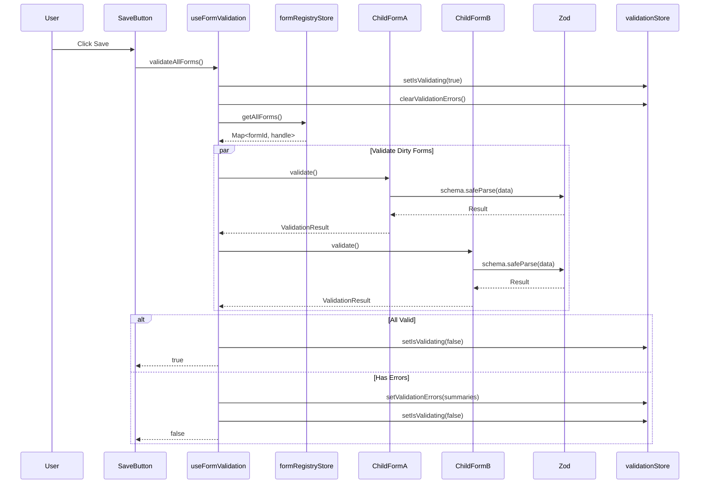

# IMPL-002: Validation Flow

## Overview

This implementation plan covers the validation system that validates all dirty forms when the save button is clicked. It uses Zod for schema validation and coordinates validation across multiple child forms using React refs.

## Related Feature

- **Feature**: [FEATURE-001: Multi-Form Save with Coordinated Validation](../features/FEATURE-001.md)
- **Acceptance Criteria**: AC2.1 - AC2.6

## Prerequisites

- [IMPL-001: Dirty State Management](./IMPL-001-dirty-state-management.md) completed
- Zod installed for schema validation
- React 19 with TypeScript configured

---

## Implementation Steps

### Step 1: Define Validation Types

Create type definitions for validation results and form handles.

**File**: `src/types/validation.types.ts`

```typescript
import { z } from 'zod/v4';

export interface ValidationError {
  field: string;
  message: string;
}

export interface ValidationResult {
  valid: boolean;
  errors: ValidationError[];
}

export interface FormValidationSummary {
  formId: string;
  formName: string;
  errors: ValidationError[];
}

export interface ChildFormHandle {
  validate: () => ValidationResult;
  submit: () => Promise<SubmitResult>;
  reset: () => void;
  getFormId: () => string;
}

export interface SubmitResult {
  success: boolean;
  error?: string;
}

// Helper to convert Zod errors to ValidationError[]
export function zodErrorsToValidationErrors(
  zodError: z.ZodError
): ValidationError[] {
  return zodError.issues.map((issue) => ({
    field: issue.path.join('.'),
    message: issue.message,
  }));
}
```

### Step 2: Create Zod Schemas for Each Form

Define validation schemas for each child form.

**File**: `src/schemas/formSchemas.ts`

```typescript
import { z } from 'zod/v4';

export const formASchema = z.object({
  name: z
    .string()
    .min(1, 'Name is required')
    .min(2, 'Name must be at least 2 characters'),
  email: z
    .string()
    .min(1, 'Email is required')
    .email('Please enter a valid email address'),
});

export const formBSchema = z.object({
  address: z.string().min(1, 'Address is required'),
  city: z.string().min(1, 'City is required'),
  zipCode: z
    .string()
    .min(1, 'ZIP code is required')
    .regex(/^\d{5}(-\d{4})?$/, 'Please enter a valid ZIP code'),
});

export const formCSchema = z.object({
  phone: z
    .string()
    .min(1, 'Phone number is required')
    .regex(/^\d{3}-\d{3}-\d{4}$/, 'Please enter phone as XXX-XXX-XXXX'),
  preferredContact: z.enum(['email', 'phone', 'mail'], {
    errorMap: () => ({ message: 'Please select a contact preference' }),
  }),
});

export type FormAData = z.infer<typeof formASchema>;
export type FormBData = z.infer<typeof formBSchema>;
export type FormCData = z.infer<typeof formCSchema>;
```

### Step 3: Create Validation Store

Create a Zustand store to manage validation state and results.

**File**: `src/stores/validationStore.ts`

```typescript
import { create } from 'zustand';
import type { FormValidationSummary } from '../types/validation.types';

interface ValidationState {
  validationErrors: FormValidationSummary[];
  isValidating: boolean;
  setValidationErrors: (errors: FormValidationSummary[]) => void;
  clearValidationErrors: () => void;
  setIsValidating: (validating: boolean) => void;
  hasValidationErrors: () => boolean;
}

export const useValidationStore = create<ValidationState>((set, get) => ({
  validationErrors: [],
  isValidating: false,

  setValidationErrors: (errors: FormValidationSummary[]) => {
    set({ validationErrors: errors });
  },

  clearValidationErrors: () => {
    set({ validationErrors: [] });
  },

  setIsValidating: (validating: boolean) => {
    set({ isValidating: validating });
  },

  hasValidationErrors: () => {
    return get().validationErrors.length > 0;
  },
}));
```

### Step 4: Create Form Registry for Ref Management

Create a registry to manage form refs without prop drilling.

**File**: `src/stores/formRegistryStore.ts`

```typescript
import { create } from 'zustand';
import type { ChildFormHandle } from '../types/validation.types';

interface FormRegistryState {
  forms: Map<string, ChildFormHandle>;
  registerForm: (formId: string, handle: ChildFormHandle) => void;
  unregisterForm: (formId: string) => void;
  getForm: (formId: string) => ChildFormHandle | undefined;
  getAllForms: () => Map<string, ChildFormHandle>;
}

export const useFormRegistryStore = create<FormRegistryState>((set, get) => ({
  forms: new Map(),

  registerForm: (formId: string, handle: ChildFormHandle) => {
    set((state) => {
      const next = new Map(state.forms);
      next.set(formId, handle);
      return { forms: next };
    });
  },

  unregisterForm: (formId: string) => {
    set((state) => {
      const next = new Map(state.forms);
      next.delete(formId);
      return { forms: next };
    });
  },

  getForm: (formId: string) => {
    return get().forms.get(formId);
  },

  getAllForms: () => {
    return get().forms;
  },
}));
```

### Step 5: Create Custom Hook for Form Registration

Create a hook that child forms use to register themselves.

**File**: `src/hooks/useFormRegistration.ts`

```typescript
import { useEffect, useImperativeHandle, type Ref } from 'react';
import { useFormRegistryStore } from '../stores/formRegistryStore';
import type { ChildFormHandle } from '../types/validation.types';

interface UseFormRegistrationOptions {
  formId: string;
  ref: Ref<ChildFormHandle>;
  handle: ChildFormHandle;
}

export function useFormRegistration({
  formId,
  ref,
  handle,
}: UseFormRegistrationOptions) {
  const registerForm = useFormRegistryStore((state) => state.registerForm);
  const unregisterForm = useFormRegistryStore((state) => state.unregisterForm);

  // Expose handle via ref for parent access
  useImperativeHandle(ref, () => handle, [handle]);

  // Register with form registry
  useEffect(() => {
    registerForm(formId, handle);
    return () => {
      unregisterForm(formId);
    };
  }, [formId, handle, registerForm, unregisterForm]);
}
```

### Step 6: Implement Validation in Child Form

Update child form to implement validation using Zod.

**File**: `src/components/ChildFormA.tsx`

```typescript
import { forwardRef, useState, useMemo } from 'react';
import { useFormDirtyTracking } from '../hooks/useFormDirtyTracking';
import { useFormRegistration } from '../hooks/useFormRegistration';
import { formASchema, type FormAData } from '../schemas/formSchemas';
import {
  zodErrorsToValidationErrors,
  type ChildFormHandle,
  type ValidationResult,
  type ValidationError,
} from '../types/validation.types';

const FORM_ID = 'formA';
const FORM_NAME = 'User Information';

const INITIAL_DATA: FormAData = { name: '', email: '' };

export const ChildFormA = forwardRef<ChildFormHandle>(function ChildFormA(
  _props,
  ref
) {
  const [formData, setFormData] = useState<FormAData>(INITIAL_DATA);
  const [errors, setErrors] = useState<ValidationError[]>([]);

  // Track dirty state
  useFormDirtyTracking({
    formId: FORM_ID,
    currentData: formData,
    initialData: INITIAL_DATA,
  });

  // Create form handle
  const handle: ChildFormHandle = useMemo(
    () => ({
      getFormId: () => FORM_ID,

      validate: (): ValidationResult => {
        const result = formASchema.safeParse(formData);

        if (result.success) {
          setErrors([]);
          return { valid: true, errors: [] };
        }

        const validationErrors = zodErrorsToValidationErrors(result.error);
        setErrors(validationErrors);
        return { valid: false, errors: validationErrors };
      },

      submit: async () => {
        // Implementation in IMPL-003
        return { success: true };
      },

      reset: () => {
        setFormData(INITIAL_DATA);
        setErrors([]);
      },
    }),
    [formData]
  );

  // Register form
  useFormRegistration({ formId: FORM_ID, ref, handle });

  const getFieldError = (field: string): string | undefined => {
    return errors.find((e) => e.field === field)?.message;
  };

  return (
    <div className="child-form">
      <h2>{FORM_NAME}</h2>

      <div className="form-field">
        <label htmlFor="name">Name</label>
        <input
          id="name"
          value={formData.name}
          onChange={(e) =>
            setFormData((prev) => ({ ...prev, name: e.target.value }))
          }
          aria-invalid={!!getFieldError('name')}
          aria-describedby={getFieldError('name') ? 'name-error' : undefined}
        />
        {getFieldError('name') && (
          <span id="name-error" className="error" role="alert">
            {getFieldError('name')}
          </span>
        )}
      </div>

      <div className="form-field">
        <label htmlFor="email">Email</label>
        <input
          id="email"
          type="email"
          value={formData.email}
          onChange={(e) =>
            setFormData((prev) => ({ ...prev, email: e.target.value }))
          }
          aria-invalid={!!getFieldError('email')}
          aria-describedby={getFieldError('email') ? 'email-error' : undefined}
        />
        {getFieldError('email') && (
          <span id="email-error" className="error" role="alert">
            {getFieldError('email')}
          </span>
        )}
      </div>
    </div>
  );
});
```

### Step 7: Create Validation Orchestration Hook

Create a hook for the parent to orchestrate validation.

**File**: `src/hooks/useFormValidation.ts`

```typescript
import { useCallback } from 'react';
import { useFormDirtyStore } from '../stores/formDirtyStore';
import { useFormRegistryStore } from '../stores/formRegistryStore';
import { useValidationStore } from '../stores/validationStore';
import type { FormValidationSummary } from '../types/validation.types';

const FORM_DISPLAY_NAMES: Record<string, string> = {
  formA: 'User Information',
  formB: 'Address',
  formC: 'Contact Preferences',
};

export function useFormValidation() {
  const dirtyForms = useFormDirtyStore((state) => state.dirtyForms);
  const getAllForms = useFormRegistryStore((state) => state.getAllForms);
  const { setValidationErrors, clearValidationErrors, setIsValidating } =
    useValidationStore();

  const validateAllForms = useCallback((): boolean => {
    setIsValidating(true);
    clearValidationErrors();

    const forms = getAllForms();
    const validationResults: FormValidationSummary[] = [];

    // Only validate dirty forms
    for (const formId of dirtyForms) {
      const form = forms.get(formId);
      if (form) {
        const result = form.validate();
        if (!result.valid) {
          validationResults.push({
            formId,
            formName: FORM_DISPLAY_NAMES[formId] ?? formId,
            errors: result.errors,
          });
        }
      }
    }

    setIsValidating(false);

    if (validationResults.length > 0) {
      setValidationErrors(validationResults);
      return false;
    }

    return true;
  }, [
    dirtyForms,
    getAllForms,
    setValidationErrors,
    clearValidationErrors,
    setIsValidating,
  ]);

  return { validateAllForms };
}
```

---

## Validation Flow Diagram



---

## Acceptance Criteria

| ID | Criterion | Validation |
|----|-----------|------------|
| AC2.1 | Clicking the save button triggers validation on all dirty forms | Verify `validate()` is called on each form in `dirtyForms` |
| AC2.2 | Forms that are not dirty are not validated | Verify `validate()` is NOT called on forms not in `dirtyForms` |
| AC2.3 | Validation errors are displayed within each child form | Verify error messages render next to invalid fields |
| AC2.4 | The parent container displays an error summary when validation fails | Verify `validationErrors` array is populated in store |
| AC2.5 | The error summary identifies which form(s) failed validation | Verify `formName` is included in each `FormValidationSummary` |
| AC2.6 | The error summary lists specific validation errors for each form | Verify `errors` array contains field-level messages |

---

## Unit Tests

**File**: `src/schemas/formSchemas.test.ts`

```typescript
import { describe, it, expect } from 'vitest';
import { formASchema, formBSchema } from './formSchemas';

describe('formASchema', () => {
  it('should pass with valid data', () => {
    const result = formASchema.safeParse({
      name: 'John Doe',
      email: 'john@example.com',
    });
    expect(result.success).toBe(true);
  });

  it('should fail when name is empty', () => {
    const result = formASchema.safeParse({
      name: '',
      email: 'john@example.com',
    });
    expect(result.success).toBe(false);
  });

  it('should fail when email is invalid', () => {
    const result = formASchema.safeParse({
      name: 'John',
      email: 'not-an-email',
    });
    expect(result.success).toBe(false);
  });

  it('should fail when name is too short', () => {
    const result = formASchema.safeParse({
      name: 'J',
      email: 'john@example.com',
    });
    expect(result.success).toBe(false);
  });
});

describe('formBSchema', () => {
  it('should pass with valid data', () => {
    const result = formBSchema.safeParse({
      address: '123 Main St',
      city: 'Springfield',
      zipCode: '12345',
    });
    expect(result.success).toBe(true);
  });

  it('should accept ZIP+4 format', () => {
    const result = formBSchema.safeParse({
      address: '123 Main St',
      city: 'Springfield',
      zipCode: '12345-6789',
    });
    expect(result.success).toBe(true);
  });

  it('should fail with invalid ZIP code', () => {
    const result = formBSchema.safeParse({
      address: '123 Main St',
      city: 'Springfield',
      zipCode: 'ABCDE',
    });
    expect(result.success).toBe(false);
  });
});
```

---

## Dependencies

- `zod` - Schema validation
- `zustand` - State management
- `vitest` - Unit testing

## Files to Create/Modify

| File | Action | Description |
|------|--------|-------------|
| `src/types/validation.types.ts` | Create | Validation type definitions |
| `src/schemas/formSchemas.ts` | Create | Zod schemas for all forms |
| `src/stores/validationStore.ts` | Create | Validation state store |
| `src/stores/formRegistryStore.ts` | Create | Form registry store |
| `src/hooks/useFormRegistration.ts` | Create | Form registration hook |
| `src/hooks/useFormValidation.ts` | Create | Validation orchestration hook |
| `src/schemas/formSchemas.test.ts` | Create | Schema unit tests |

## Next Steps

After implementing validation flow, proceed to:
- [IMPL-003: Submission Flow](./IMPL-003-submission-flow.md)
