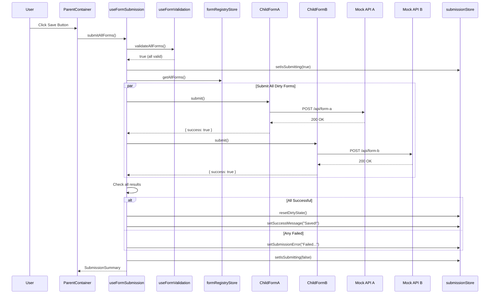

# IMPL-003: Submission Flow

## Overview

This implementation plan covers the submission orchestration system that submits all validated forms to their respective API endpoints. Submissions only occur after all validations pass, and are executed in parallel for performance.

## Related Feature

- **Feature**: [FEATURE-001: Multi-Form Save with Coordinated Validation](../features/FEATURE-001.md)
- **Acceptance Criteria**: AC3.1 - AC3.5, AC4.1 - AC4.4

## Prerequisites

- [IMPL-001: Dirty State Management](./IMPL-001-dirty-state-management.md) completed
- [IMPL-002: Validation Flow](./IMPL-002-validation-flow.md) completed
- Zustand and Zod configured

---

## Implementation Steps

### Step 1: Define Submission Types

Extend type definitions for submission handling.

**File**: `src/types/submission.types.ts`

```typescript
export interface SubmitResult {
  success: boolean;
  formId: string;
  error?: string;
  data?: unknown;
}

export interface SubmissionState {
  isSubmitting: boolean;
  submissionResults: SubmitResult[];
  submissionError: string | null;
}

export interface SubmissionSummary {
  success: boolean;
  results: SubmitResult[];
  failedForms: string[];
}
```

### Step 2: Create Mock API Service

Create a mock API service for development and testing.

**File**: `src/services/mockApi.ts`

```typescript
import type { FormAData, FormBData, FormCData } from '../schemas/formSchemas';

const delay = (ms: number) => new Promise((resolve) => setTimeout(resolve, ms));

// Simulate random failures for testing (10% failure rate)
const shouldFail = () => Math.random() < 0.1;

interface ApiResponse<T = unknown> {
  success: boolean;
  data?: T;
  error?: string;
}

export const mockApi = {
  async submitFormA(data: FormAData): Promise<ApiResponse> {
    await delay(500 + Math.random() * 500);

    if (shouldFail()) {
      return {
        success: false,
        error: 'Failed to save user information. Please try again.',
      };
    }

    console.log('[MockAPI] Form A submitted:', data);
    return {
      success: true,
      data: { id: crypto.randomUUID(), ...data },
    };
  },

  async submitFormB(data: FormBData): Promise<ApiResponse> {
    await delay(600 + Math.random() * 400);

    if (shouldFail()) {
      return {
        success: false,
        error: 'Failed to save address. Please try again.',
      };
    }

    console.log('[MockAPI] Form B submitted:', data);
    return {
      success: true,
      data: { id: crypto.randomUUID(), ...data },
    };
  },

  async submitFormC(data: FormCData): Promise<ApiResponse> {
    await delay(400 + Math.random() * 600);

    if (shouldFail()) {
      return {
        success: false,
        error: 'Failed to save contact preferences. Please try again.',
      };
    }

    console.log('[MockAPI] Form C submitted:', data);
    return {
      success: true,
      data: { id: crypto.randomUUID(), ...data },
    };
  },
};
```

### Step 3: Create Submission Store

Create a Zustand store to manage submission state.

**File**: `src/stores/submissionStore.ts`

```typescript
import { create } from 'zustand';
import type { SubmitResult } from '../types/submission.types';

interface SubmissionState {
  isSubmitting: boolean;
  submissionResults: SubmitResult[];
  submissionError: string | null;
  successMessage: string | null;

  setIsSubmitting: (submitting: boolean) => void;
  setSubmissionResults: (results: SubmitResult[]) => void;
  setSubmissionError: (error: string | null) => void;
  setSuccessMessage: (message: string | null) => void;
  reset: () => void;
}

export const useSubmissionStore = create<SubmissionState>((set) => ({
  isSubmitting: false,
  submissionResults: [],
  submissionError: null,
  successMessage: null,

  setIsSubmitting: (submitting: boolean) => {
    set({ isSubmitting: submitting });
  },

  setSubmissionResults: (results: SubmitResult[]) => {
    set({ submissionResults: results });
  },

  setSubmissionError: (error: string | null) => {
    set({ submissionError: error, successMessage: null });
  },

  setSuccessMessage: (message: string | null) => {
    set({ successMessage: message, submissionError: null });
  },

  reset: () => {
    set({
      isSubmitting: false,
      submissionResults: [],
      submissionError: null,
      successMessage: null,
    });
  },
}));
```

### Step 4: Update Child Form with Submit Implementation

Implement the submit method in child forms.

**File**: `src/components/ChildFormA.tsx` (submit implementation)

```typescript
import { mockApi } from '../services/mockApi';
import type { SubmitResult } from '../types/submission.types';

// Inside the component, update the handle:
const handle: ChildFormHandle = useMemo(
  () => ({
    getFormId: () => FORM_ID,

    validate: (): ValidationResult => {
      // ... existing validation code
    },

    submit: async (): Promise<SubmitResult> => {
      try {
        const response = await mockApi.submitFormA(formData);

        if (!response.success) {
          return {
            success: false,
            formId: FORM_ID,
            error: response.error,
          };
        }

        return {
          success: true,
          formId: FORM_ID,
          data: response.data,
        };
      } catch (error) {
        return {
          success: false,
          formId: FORM_ID,
          error:
            error instanceof Error ? error.message : 'Unknown error occurred',
        };
      }
    },

    reset: () => {
      setFormData(INITIAL_DATA);
      setErrors([]);
    },
  }),
  [formData]
);
```

### Step 5: Create Submission Orchestration Hook

Create the main hook that coordinates the entire save flow.

**File**: `src/hooks/useFormSubmission.ts`

```typescript
import { useCallback } from 'react';
import { useFormDirtyStore } from '../stores/formDirtyStore';
import { useFormRegistryStore } from '../stores/formRegistryStore';
import { useSubmissionStore } from '../stores/submissionStore';
import { useValidationStore } from '../stores/validationStore';
import { useFormValidation } from './useFormValidation';
import type { SubmitResult, SubmissionSummary } from '../types/submission.types';

export function useFormSubmission() {
  const dirtyForms = useFormDirtyStore((state) => state.dirtyForms);
  const resetDirtyState = useFormDirtyStore((state) => state.resetDirtyState);
  const getAllForms = useFormRegistryStore((state) => state.getAllForms);
  const { validateAllForms } = useFormValidation();
  const {
    setIsSubmitting,
    setSubmissionResults,
    setSubmissionError,
    setSuccessMessage,
    isSubmitting,
  } = useSubmissionStore();
  const { clearValidationErrors } = useValidationStore();

  const submitAllForms = useCallback(async (): Promise<SubmissionSummary> => {
    // Step 1: Validate all forms first
    const isValid = validateAllForms();

    if (!isValid) {
      return {
        success: false,
        results: [],
        failedForms: [],
      };
    }

    // Step 2: Clear previous errors and start submission
    clearValidationErrors();
    setIsSubmitting(true);
    setSubmissionError(null);

    const forms = getAllForms();
    const results: SubmitResult[] = [];

    try {
      // Step 3: Submit all dirty forms in parallel
      const submitPromises = Array.from(dirtyForms).map(async (formId) => {
        const form = forms.get(formId);
        if (form) {
          return form.submit();
        }
        return {
          success: false,
          formId,
          error: 'Form not found',
        };
      });

      const submitResults = await Promise.all(submitPromises);
      results.push(...submitResults);

      // Step 4: Check for failures
      const failedForms = results
        .filter((r) => !r.success)
        .map((r) => r.formId);

      if (failedForms.length > 0) {
        const errorMessage = `Submission failed for: ${failedForms.join(', ')}`;
        setSubmissionError(errorMessage);
        setSubmissionResults(results);

        return {
          success: false,
          results,
          failedForms,
        };
      }

      // Step 5: Success - reset dirty state
      resetDirtyState();
      setSubmissionResults(results);
      setSuccessMessage('All changes saved successfully!');

      return {
        success: true,
        results,
        failedForms: [],
      };
    } catch (error) {
      const errorMessage =
        error instanceof Error ? error.message : 'An unexpected error occurred';
      setSubmissionError(errorMessage);

      return {
        success: false,
        results,
        failedForms: [],
      };
    } finally {
      setIsSubmitting(false);
    }
  }, [
    dirtyForms,
    getAllForms,
    validateAllForms,
    clearValidationErrors,
    resetDirtyState,
    setIsSubmitting,
    setSubmissionResults,
    setSubmissionError,
    setSuccessMessage,
  ]);

  return {
    submitAllForms,
    isSubmitting,
  };
}
```

### Step 6: Integrate with Parent Container

Update the parent container to use the submission hook.

**File**: `src/components/ParentContainer.tsx`

```typescript
import { useFormDirtyStore } from '../stores/formDirtyStore';
import { useSubmissionStore } from '../stores/submissionStore';
import { useFormSubmission } from '../hooks/useFormSubmission';
import { ErrorSummary } from './ErrorSummary';
import { SuccessMessage } from './SuccessMessage';
import { ChildFormA } from './ChildFormA';
import { ChildFormB } from './ChildFormB';
import { ChildFormC } from './ChildFormC';

export function ParentContainer() {
  const isDirty = useFormDirtyStore((state) => state.dirtyForms.size > 0);
  const { isSubmitting, submissionError, successMessage } = useSubmissionStore();
  const { submitAllForms } = useFormSubmission();

  const handleSave = async () => {
    await submitAllForms();
  };

  return (
    <div className="parent-container">
      <header className="form-header">
        <h1>Multi-Form Editor</h1>
        <button
          onClick={handleSave}
          disabled={!isDirty || isSubmitting}
          className="save-button"
        >
          {isSubmitting ? 'Saving...' : 'Save All Changes'}
        </button>
      </header>

      {successMessage && <SuccessMessage message={successMessage} />}
      {submissionError && (
        <div className="submission-error" role="alert">
          {submissionError}
        </div>
      )}

      <ErrorSummary />

      <div className="forms-container">
        <ChildFormA />
        <ChildFormB />
        <ChildFormC />
      </div>
    </div>
  );
}
```

---

## Submission Flow Diagram



---

## Acceptance Criteria

| ID | Criterion | Validation |
|----|-----------|------------|
| AC3.1 | If any validation fails, no API calls are made | Verify no network requests when validation fails |
| AC3.2 | Only when all validations pass do submissions occur | Verify API calls only after `validateAllForms()` returns true |
| AC3.3 | Each dirty form submits to its respective mock endpoint | Verify each form calls its specific API method |
| AC3.4 | Forms that are not dirty are not submitted | Verify `submit()` only called for forms in `dirtyForms` |
| AC3.5 | Submissions occur in parallel for performance | Verify `Promise.all()` is used for concurrent submission |
| AC4.1 | On successful submission, dirty state is cleared | Verify `dirtyForms` is empty after success |
| AC4.2 | Save button becomes disabled after successful submission | Verify button disabled when `dirtyForms.size === 0` |
| AC4.3 | A success message is displayed to the user | Verify `successMessage` is set in store |
| AC4.4 | If any submission fails, an error is displayed | Verify `submissionError` is set for failures |

---

## Unit Tests

**File**: `src/hooks/useFormSubmission.test.ts`

```typescript
import { describe, it, expect, vi, beforeEach } from 'vitest';
import { renderHook, act } from '@testing-library/react';
import { useFormSubmission } from './useFormSubmission';
import { useFormDirtyStore } from '../stores/formDirtyStore';
import { useFormRegistryStore } from '../stores/formRegistryStore';

describe('useFormSubmission', () => {
  beforeEach(() => {
    useFormDirtyStore.getState().resetDirtyState();
    // Reset form registry
    const registry = useFormRegistryStore.getState();
    registry.forms.clear();
  });

  it('should not submit when validation fails', async () => {
    const mockSubmit = vi.fn();
    const mockValidate = vi.fn().mockReturnValue({ valid: false, errors: [] });

    // Register a form
    useFormRegistryStore.getState().registerForm('formA', {
      validate: mockValidate,
      submit: mockSubmit,
      reset: vi.fn(),
      getFormId: () => 'formA',
    });

    useFormDirtyStore.getState().setFormDirty('formA', true);

    const { result } = renderHook(() => useFormSubmission());

    await act(async () => {
      await result.current.submitAllForms();
    });

    expect(mockSubmit).not.toHaveBeenCalled();
  });

  it('should submit all dirty forms when validation passes', async () => {
    const mockSubmitA = vi.fn().mockResolvedValue({ success: true, formId: 'formA' });
    const mockSubmitB = vi.fn().mockResolvedValue({ success: true, formId: 'formB' });

    useFormRegistryStore.getState().registerForm('formA', {
      validate: () => ({ valid: true, errors: [] }),
      submit: mockSubmitA,
      reset: vi.fn(),
      getFormId: () => 'formA',
    });

    useFormRegistryStore.getState().registerForm('formB', {
      validate: () => ({ valid: true, errors: [] }),
      submit: mockSubmitB,
      reset: vi.fn(),
      getFormId: () => 'formB',
    });

    useFormDirtyStore.getState().setFormDirty('formA', true);
    useFormDirtyStore.getState().setFormDirty('formB', true);

    const { result } = renderHook(() => useFormSubmission());

    await act(async () => {
      const summary = await result.current.submitAllForms();
      expect(summary.success).toBe(true);
    });

    expect(mockSubmitA).toHaveBeenCalled();
    expect(mockSubmitB).toHaveBeenCalled();
  });

  it('should not submit clean forms', async () => {
    const mockSubmitA = vi.fn().mockResolvedValue({ success: true, formId: 'formA' });
    const mockSubmitB = vi.fn().mockResolvedValue({ success: true, formId: 'formB' });

    useFormRegistryStore.getState().registerForm('formA', {
      validate: () => ({ valid: true, errors: [] }),
      submit: mockSubmitA,
      reset: vi.fn(),
      getFormId: () => 'formA',
    });

    useFormRegistryStore.getState().registerForm('formB', {
      validate: () => ({ valid: true, errors: [] }),
      submit: mockSubmitB,
      reset: vi.fn(),
      getFormId: () => 'formB',
    });

    // Only formA is dirty
    useFormDirtyStore.getState().setFormDirty('formA', true);

    const { result } = renderHook(() => useFormSubmission());

    await act(async () => {
      await result.current.submitAllForms();
    });

    expect(mockSubmitA).toHaveBeenCalled();
    expect(mockSubmitB).not.toHaveBeenCalled();
  });

  it('should reset dirty state on successful submission', async () => {
    const mockSubmit = vi.fn().mockResolvedValue({ success: true, formId: 'formA' });

    useFormRegistryStore.getState().registerForm('formA', {
      validate: () => ({ valid: true, errors: [] }),
      submit: mockSubmit,
      reset: vi.fn(),
      getFormId: () => 'formA',
    });

    useFormDirtyStore.getState().setFormDirty('formA', true);

    const { result } = renderHook(() => useFormSubmission());

    await act(async () => {
      await result.current.submitAllForms();
    });

    expect(useFormDirtyStore.getState().dirtyForms.size).toBe(0);
  });
});
```

---

## Dependencies

- `zustand` - State management
- `vitest` - Unit testing
- `@testing-library/react` - React testing utilities

## Files to Create/Modify

| File | Action | Description |
|------|--------|-------------|
| `src/types/submission.types.ts` | Create | Submission type definitions |
| `src/services/mockApi.ts` | Create | Mock API service |
| `src/stores/submissionStore.ts` | Create | Submission state store |
| `src/hooks/useFormSubmission.ts` | Create | Submission orchestration hook |
| `src/hooks/useFormSubmission.test.ts` | Create | Hook unit tests |
| `src/components/ChildFormA.tsx` | Modify | Add submit implementation |

## Next Steps

After implementing submission flow, proceed to:
- [IMPL-004: Error Handling and Display](./IMPL-004-error-handling.md)
