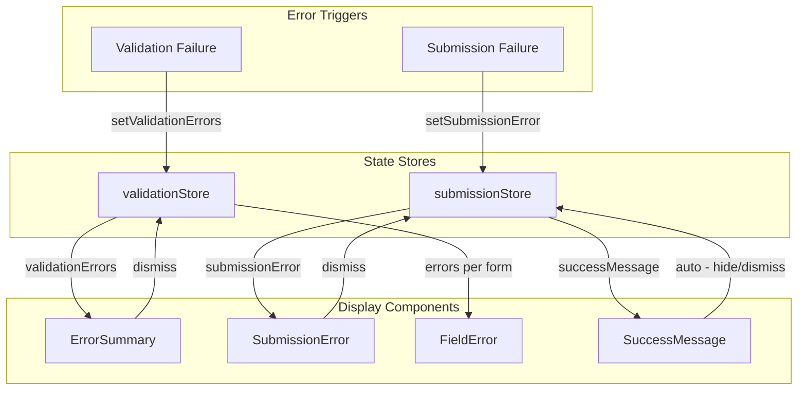

# IMPL-004: Error Handling and Display

## Overview

This implementation plan covers the error handling system that displays validation errors, submission failures, and
provides clear feedback to users. It includes the error summary component, inline field errors, and toast notifications.

## Related Feature

- **Feature**: [FEATURE-001: Multi-Form Save with Coordinated Validation](../features/FEATURE-001.md)
- **Acceptance Criteria**: AC2.4 - AC2.6, AC4.4, AC5.3 - AC5.4

## Prerequisites

- [IMPL-001: Dirty State Management](./IMPL-001-dirty-state-management.md) completed
- [IMPL-002: Validation Flow](./IMPL-002-validation-flow.md) completed
- [IMPL-003: Submission Flow](./IMPL-003-submission-flow.md) completed
- Tailwind CSS configured

---

## Implementation Steps

### Step 1: Define Error Display Types

Create type definitions for error display components.

**File**: `src/types/error.types.ts`

```typescript
export type ErrorSeverity = 'error' | 'warning' | 'info';

export interface DisplayError {
    id: string;
    message: string;
    severity: ErrorSeverity;
    dismissible: boolean;
    autoHide?: number; // milliseconds
}

export interface FieldError {
    field: string;
    message: string;
}

export interface FormErrorGroup {
    formId: string;
    formName: string;
    errors: FieldError[];
}
```

### Step 2: Create Error Summary Component

Create the main error summary component that displays all validation errors.

**File**: `src/components/ErrorSummary.tsx`

```tsx
import {useValidationStore} from '../stores/validationStore';

export function ErrorSummary() {
    const validationErrors = useValidationStore((state) => state.validationErrors);
    const clearValidationErrors = useValidationStore(
        (state) => state.clearValidationErrors
    );

    if (validationErrors.length === 0) {
        return null;
    }

    return (
        <div
            className="error-summary bg-red-50 border border-red-200 rounded-lg p-4 mb-6"
            role="alert"
            aria-labelledby="error-summary-title">
            <div
                className="flex items-start justify-between">
                <div
                    className="flex items-start">
                    <svg
                        className="h-5 w-5 text-red-400 mt-0.5"
                        viewBox="0 0 20 20"
                        fill="currentColor"
                        aria
                    - hidden = "true"
                    >
                    <path
                        fillRule="evenodd"
                        d="M10 18a8 8 0 100-16 8 8 0 000 16zM8.28 7.22a.75.75 0 00-1.06 1.06L8.94 10l-1.72 1.72a.75.75 0 101.06 1.06L10 11.06l1.72 1.72a.75.75 0 101.06-1.06L11.06 10l1.72-1.72a.75.75 0 00-1.06-1.06L10 8.94 8.28 7.22z"
                        clipRule="evenodd"
                        / >
                    < /svg>
                    <div
                        className="ml-3">
                        <h3
                            id="error-summary-title"
                            className="text-sm font-medium text-red-800"
                        >
                            Please
                            fix
                            the
                            following
                            errors
                            before
                            saving:
                        </h3>
                        <div
                            className="mt-2 text-sm text-red-700">
                            <ul className="list-none space-y-2">
                                {
                                    validationErrors.map((formError) => (
                                        <li key={formError.formId}>
                <span className="font-semibold"> {formError.formName}
                    :
    </span>
                                            < ul
                                                className="list-disc list-inside ml-4 mt-1">
                                                {
                                                    formError.errors.map((error, index) => (
                                                        <li key={`${formError.formId}-${error.field}-${index}`
                                                        }>
                                                            {error.message}
                                                        < /li>
                                                    ))
                                                }
                                            </ul>
                                        < /li>
                                    ))
                                }
                            </ul>
                        < /div>
                    < /div>
                < /div>
                < button
                    type="button"
                    onClick={clearValidationErrors}
                    className="ml-4 inline-flex text-red-400 hover:text-red-500 focus:outline-none focus:ring-2 focus:ring-red-500 focus:ring-offset-2"
                    aria
                - label = "Dismiss errors"
                >
                < svg
                    className="h-5 w-5"
                    viewBox="0 0 20 20"
                    fill="currentColor">
                    < path
                        d="M6.28 5.22a.75.75 0 00-1.06 1.06L8.94 10l-3.72 3.72a.75.75 0 101.06 1.06L10 11.06l3.72 3.72a.75.75 0 101.06-1.06L11.06 10l3.72-3.72a.75.75 0 00-1.06-1.06L10 8.94 6.28 5.22z" / >
                < /svg>
            < /button>
        < /div>
< /div>
)
    ;
}
```

### Step 3: Create Inline Field Error Component

Create a reusable component for displaying field-level errors.

**File**: `src/components/FieldError.tsx`

```typescript
interface FieldErrorProps {
    id: string;
    message: string | undefined;
}

export function FieldError({id, message}: FieldErrorProps) {
    if (!message) {
        return null;
    }

    return (
        <p
            id = {id}
    className = "mt-1 text-sm text-red-600 flex items-center"
    role = "alert"
    >
    <svg
        className = "h-4 w-4 mr-1 flex-shrink-0"
    viewBox = "0 0 20 20"
    fill = "currentColor"
    aria - hidden = "true"
    >
    <path
        fillRule = "evenodd"
    d = "M18 10a8 8 0 11-16 0 8 8 0 0116 0zm-8-5a.75.75 0 01.75.75v4.5a.75.75 0 01-1.5 0v-4.5A.75.75 0 0110 5zm0 10a1 1 0 100-2 1 1 0 000 2z"
    clipRule = "evenodd"
        / >
        </svg>
    {
        message
    }
    </p>
)
    ;
}
```

### Step 4: Create Submission Error Alert

Create a component for displaying submission failures.

**File**: `src/components/SubmissionError.tsx`

```typescript
import {useSubmissionStore} from '../stores/submissionStore';

export function SubmissionError() {
    const submissionError = useSubmissionStore((state) => state.submissionError);
    const setSubmissionError = useSubmissionStore(
        (state) => state.setSubmissionError
    );

    if (!submissionError) {
        return null;
    }

    return (
        <div
            className = "submission-error bg-red-100 border-l-4 border-red-500 p-4 mb-6"
    role = "alert"
    >
    <div className = "flex items-start justify-between" >
    <div className = "flex" >
    <svg
        className = "h-5 w-5 text-red-500"
    viewBox = "0 0 20 20"
    fill = "currentColor"
    aria - hidden = "true"
    >
    <path
        fillRule = "evenodd"
    d = "M10 18a8 8 0 100-16 8 8 0 000 16zM8.28 7.22a.75.75 0 00-1.06 1.06L8.94 10l-1.72 1.72a.75.75 0 101.06 1.06L10 11.06l1.72 1.72a.75.75 0 101.06-1.06L11.06 10l1.72-1.72a.75.75 0 00-1.06-1.06L10 8.94 8.28 7.22z"
    clipRule = "evenodd"
        / >
        </svg>
        <div
    className = "ml-3" >
    <h3 className = "text-sm font-medium text-red-800" >
        Submission
    Failed
    < /h3>
    < p
    className = "mt-1 text-sm text-red-700" > {submissionError} < /p>
        < /div>
        < /div>
        < button
    type = "button"
    onClick = {()
=>
    setSubmissionError(null)
}
    className = "ml-4 text-red-400 hover:text-red-500"
    aria - label = "Dismiss error"
    >
    <svg className = "h-5 w-5"
    viewBox = "0 0 20 20"
    fill = "currentColor" >
    <path d = "M6.28 5.22a.75.75 0 00-1.06 1.06L8.94 10l-3.72 3.72a.75.75 0 101.06 1.06L10 11.06l3.72 3.72a.75.75 0 101.06-1.06L11.06 10l3.72-3.72a.75.75 0 00-1.06-1.06L10 8.94 6.28 5.22z" / >
        </svg>
        < /button>
        < /div>
        < /div>
)
    ;
}
```

### Step 5: Create Success Message Component

Create a component for displaying success feedback.

**File**: `src/components/SuccessMessage.tsx`

```typescript
import {useEffect} from 'react';
import {useSubmissionStore} from '../stores/submissionStore';

const AUTO_HIDE_DELAY = 5000; // 5 seconds

export function SuccessMessage() {
    const successMessage = useSubmissionStore((state) => state.successMessage);
    const setSuccessMessage = useSubmissionStore(
        (state) => state.setSuccessMessage
    );

    useEffect(() => {
        if (successMessage) {
            const timer = setTimeout(() => {
                setSuccessMessage(null);
            }, AUTO_HIDE_DELAY);

            return () => clearTimeout(timer);
        }
    }, [successMessage, setSuccessMessage]);

    if (!successMessage) {
        return null;
    }

    return (
        <div
            className = "success-message bg-green-50 border-l-4 border-green-500 p-4 mb-6"
    role = "status"
    aria - live = "polite"
    >
    <div className = "flex items-center justify-between" >
    <div className = "flex" >
    <svg
        className = "h-5 w-5 text-green-500"
    viewBox = "0 0 20 20"
    fill = "currentColor"
    aria - hidden = "true"
    >
    <path
        fillRule = "evenodd"
    d = "M10 18a8 8 0 100-16 8 8 0 000 16zm3.857-9.809a.75.75 0 00-1.214-.882l-3.483 4.79-1.88-1.88a.75.75 0 10-1.06 1.061l2.5 2.5a.75.75 0 001.137-.089l4-5.5z"
    clipRule = "evenodd"
        / >
        </svg>
        < p
    className = "ml-3 text-sm font-medium text-green-800" >
        {successMessage}
        < /p>
        < /div>
        < button
    type = "button"
    onClick = {()
=>
    setSuccessMessage(null)
}
    className = "ml-4 text-green-400 hover:text-green-500"
    aria - label = "Dismiss message"
    >
    <svg className = "h-5 w-5"
    viewBox = "0 0 20 20"
    fill = "currentColor" >
    <path d = "M6.28 5.22a.75.75 0 00-1.06 1.06L8.94 10l-3.72 3.72a.75.75 0 101.06 1.06L10 11.06l3.72 3.72a.75.75 0 101.06-1.06L11.06 10l3.72-3.72a.75.75 0 00-1.06-1.06L10 8.94 6.28 5.22z" / >
        </svg>
        < /button>
        < /div>
        < /div>
)
    ;
}
```

### Step 6: Create Form Field Wrapper with Error Styling

Create a reusable form field wrapper that handles error states.

**File**: `src/components/FormField.tsx`

```typescript
import {type ReactNode, type InputHTMLAttributes} from 'react';
import {FieldError} from './FieldError';

interface FormFieldProps extends InputHTMLAttributes<HTMLInputElement> {
    label: string;
    name: string;
    error?: string;
    children?: ReactNode;
}

export function FormField({
                              label,
                              name,
                              error,
                              children,
                              ...inputProps
                          }: FormFieldProps) {
    const errorId = `${name}-error`;
    const hasError = !!error;

    return (
        <div className = "form-field mb-4" >
        <label
            htmlFor = {name}
    className = "block text-sm font-medium text-gray-700 mb-1"
        >
        {label}
        < /label>
    {
        children ?? (
            <input
                id = {name}
        name = {name}
        aria - invalid = {hasError}
        aria - describedby = {hasError ? errorId : undefined}
        className = {`
            block w-full rounded-md shadow-sm sm:text-sm
            ${
            hasError
                ? 'border-red-300 text-red-900 placeholder-red-300 focus:border-red-500 focus:ring-red-500'
                : 'border-gray-300 focus:border-blue-500 focus:ring-blue-500'
        }
          `
    }
        {...
            inputProps
        }
        />
    )
    }
    <FieldError id = {errorId}
    message = {error}
    />
    < /div>
)
    ;
}
```

### Step 7: Create Custom Hook for Field Error Access

Create a hook for easy access to field-level errors in forms.

**File**: `src/hooks/useFieldErrors.ts`

```typescript
import {useCallback, useState} from 'react';
import type {ValidationError} from '../types/validation.types';

export function useFieldErrors() {
    const [errors, setErrors] = useState<ValidationError[]>([]);

    const getFieldError = useCallback(
        (field: string): string | undefined => {
            return errors.find((e) => e.field === field)?.message;
        },
        [errors]
    );

    const hasFieldError = useCallback(
        (field: string): boolean => {
            return errors.some((e) => e.field === field);
        },
        [errors]
    );

    const clearErrors = useCallback(() => {
        setErrors([]);
    }, []);

    const clearFieldError = useCallback((field: string) => {
        setErrors((prev) => prev.filter((e) => e.field !== field));
    }, []);

    return {
        errors,
        setErrors,
        getFieldError,
        hasFieldError,
        clearErrors,
        clearFieldError,
    };
}
```

### Step 8: Update Child Form with Error Display

Update child forms to display field-level errors properly.

**File**: `src/components/ChildFormA.tsx` (error display section)

```typescript
import {FormField} from './FormField';
import {useFieldErrors} from '../hooks/useFieldErrors';

// Inside component:
const {errors, setErrors, getFieldError, clearErrors} = useFieldErrors();

// In the validate method:
validate: (): ValidationResult => {
    const result = formASchema.safeParse(formData);

    if (result.success) {
        clearErrors();
        return {valid: true, errors: []};
    }

    const validationErrors = zodErrorsToValidationErrors(result.error);
    setErrors(validationErrors);
    return {valid: false, errors: validationErrors};
},

// In the JSX:
return (
    <div className = "child-form bg-white rounded-lg shadow p-6" >
    <h2 className = "text-lg font-semibold mb-4" > User
Information < /h2>

< FormField
label = "Name"
name = "name"
value = {formData.name}
onChange = {(e)
=>
setFormData((prev) => ({...prev, name: e.target.value}))
}
error = {getFieldError('name'
)
}
/>

< FormField
label = "Email"
name = "email"
type = "email"
value = {formData.email}
onChange = {(e)
=>
setFormData((prev) => ({...prev, email: e.target.value}))
}
error = {getFieldError('email'
)
}
/>
< /div>
)
;
```

---

## Error Flow Diagram



---

## Acceptance Criteria

| ID    | Criterion                                                     | Validation                                            |
|-------|---------------------------------------------------------------|-------------------------------------------------------|
| AC2.4 | Parent container displays error summary when validation fails | Verify `ErrorSummary` renders with `validationErrors` |
| AC2.5 | Error summary identifies which form(s) failed                 | Verify `formName` is displayed for each failed form   |
| AC2.6 | Error summary lists specific errors for each form             | Verify individual error messages are listed           |
| AC4.4 | Submission failure displays an error                          | Verify `SubmissionError` component renders            |
| AC5.3 | Validation error messages are clear and actionable            | Verify messages describe what needs to be fixed       |
| AC5.4 | Error summary can be dismissed or auto-clears                 | Verify dismiss button works and errors clear on retry |

---

## Unit Tests

**File**: `src/components/ErrorSummary.test.tsx`

```typescript
import {describe, it, expect, beforeEach} from 'vitest';
import {render, screen, fireEvent} from '@testing-library/react';
import {ErrorSummary} from './ErrorSummary';
import {useValidationStore} from '../stores/validationStore';

describe('ErrorSummary', () => {
    beforeEach(() => {
        useValidationStore.setState({validationErrors: []});
    });

    it('should not render when there are no errors', () => {
        render(<ErrorSummary / >);
        expect(screen.queryByRole('alert')).not.toBeInTheDocument();
    });

    it('should render when there are validation errors', () => {
        useValidationStore.setState({
            validationErrors: [
                {
                    formId: 'formA',
                    formName: 'User Information',
                    errors: [{field: 'name', message: 'Name is required'}],
                },
            ],
        });

        render(<ErrorSummary / >);
        expect(screen.getByRole('alert')).toBeInTheDocument();
        expect(screen.getByText('User Information:')).toBeInTheDocument();
        expect(screen.getByText('Name is required')).toBeInTheDocument();
    });

    it('should display multiple form errors', () => {
        useValidationStore.setState({
            validationErrors: [
                {
                    formId: 'formA',
                    formName: 'User Information',
                    errors: [{field: 'name', message: 'Name is required'}],
                },
                {
                    formId: 'formB',
                    formName: 'Address',
                    errors: [{field: 'city', message: 'City is required'}],
                },
            ],
        });

        render(<ErrorSummary / >);
        expect(screen.getByText('User Information:')).toBeInTheDocument();
        expect(screen.getByText('Address:')).toBeInTheDocument();
    });

    it('should clear errors when dismiss button is clicked', () => {
        useValidationStore.setState({
            validationErrors: [
                {
                    formId: 'formA',
                    formName: 'User Information',
                    errors: [{field: 'name', message: 'Name is required'}],
                },
            ],
        });

        render(<ErrorSummary / >);

        const dismissButton = screen.getByLabelText('Dismiss errors');
        fireEvent.click(dismissButton);

        expect(useValidationStore.getState().validationErrors).toHaveLength(0);
    });
});
```

**File**: `src/components/SuccessMessage.test.tsx`

```typescript
import {describe, it, expect, beforeEach, vi} from 'vitest';
import {render, screen, act} from '@testing-library/react';
import {SuccessMessage} from './SuccessMessage';
import {useSubmissionStore} from '../stores/submissionStore';

describe('SuccessMessage', () => {
    beforeEach(() => {
        vi.useFakeTimers();
        useSubmissionStore.setState({successMessage: null});
    });

    afterEach(() => {
        vi.useRealTimers();
    });

    it('should not render when there is no success message', () => {
        render(<SuccessMessage / >);
        expect(screen.queryByRole('status')).not.toBeInTheDocument();
    });

    it('should render when there is a success message', () => {
        useSubmissionStore.setState({successMessage: 'All changes saved!'});

        render(<SuccessMessage / >);
        expect(screen.getByRole('status')).toBeInTheDocument();
        expect(screen.getByText('All changes saved!')).toBeInTheDocument();
    });

    it('should auto-hide after 5 seconds', () => {
        useSubmissionStore.setState({successMessage: 'All changes saved!'});

        render(<SuccessMessage / >);
        expect(screen.getByRole('status')).toBeInTheDocument();

        act(() => {
            vi.advanceTimersByTime(5000);
        });

        expect(useSubmissionStore.getState().successMessage).toBeNull();
    });
});
```

---

## Accessibility Considerations

1. **ARIA Roles**: Use `role="alert"` for errors, `role="status"` for success
2. **Live Regions**: Use `aria-live="polite"` for non-critical updates
3. **Focus Management**: Move focus to error summary when validation fails
4. **Color Contrast**: Ensure error text meets WCAG 2.1 AA standards
5. **Descriptive Messages**: Error messages should explain how to fix the issue

---

## Dependencies

- `tailwindcss` - Styling
- `vitest` - Unit testing
- `@testing-library/react` - Component testing

## Files to Create/Modify

| File                                     | Action | Description                    |
|------------------------------------------|--------|--------------------------------|
| `src/types/error.types.ts`               | Create | Error display type definitions |
| `src/components/ErrorSummary.tsx`        | Create | Error summary component        |
| `src/components/FieldError.tsx`          | Create | Inline field error component   |
| `src/components/SubmissionError.tsx`     | Create | Submission error alert         |
| `src/components/SuccessMessage.tsx`      | Create | Success message component      |
| `src/components/FormField.tsx`           | Create | Form field wrapper             |
| `src/hooks/useFieldErrors.ts`            | Create | Field error access hook        |
| `src/components/ErrorSummary.test.tsx`   | Create | Error summary tests            |
| `src/components/SuccessMessage.test.tsx` | Create | Success message tests          |

## Next Steps

After implementing error handling, proceed to:

- [IMPL-005: UI Components](./IMPL-005-ui-components.md)
