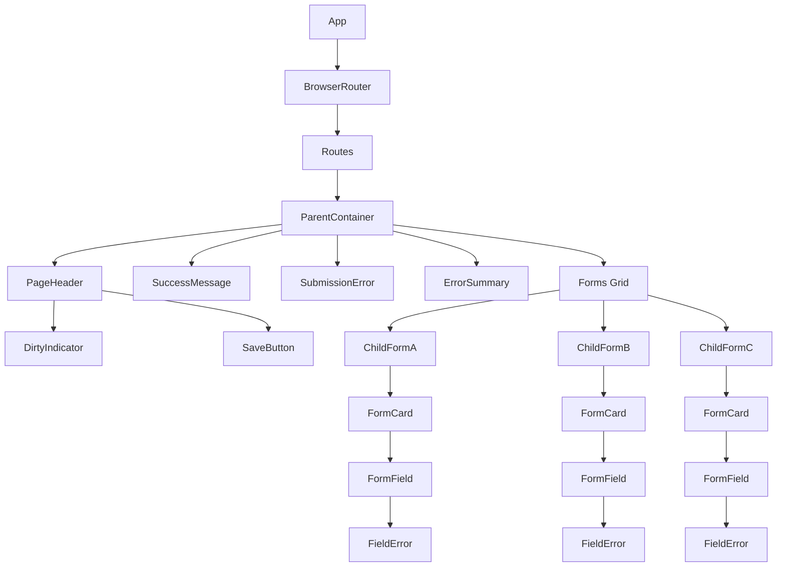

# IMPL-005: UI Components

## Overview

This implementation plan covers the main UI components including the parent container layout, save button with loading states, child form components, and the overall page structure. It brings together all previous implementations into a cohesive user interface.

## Related Feature

- **Feature**: [FEATURE-001: Multi-Form Save with Coordinated Validation](../features/FEATURE-001.md)
- **Acceptance Criteria**: AC5.1 - AC5.2

## Prerequisites

- [IMPL-001: Dirty State Management](./IMPL-001-dirty-state-management.md) completed
- [IMPL-002: Validation Flow](./IMPL-002-validation-flow.md) completed
- [IMPL-003: Submission Flow](./IMPL-003-submission-flow.md) completed
- [IMPL-004: Error Handling and Display](./IMPL-004-error-handling.md) completed
- Tailwind CSS configured
- React Router configured

---

## Implementation Steps

### Step 1: Create Save Button Component

Create a reusable save button with loading and disabled states.

**File**: `src/components/SaveButton.tsx`

```typescript
import { useFormDirtyStore } from '../stores/formDirtyStore';
import { useSubmissionStore } from '../stores/submissionStore';

interface SaveButtonProps {
  onClick: () => void;
}

export function SaveButton({ onClick }: SaveButtonProps) {
  const isDirty = useFormDirtyStore((state) => state.dirtyForms.size > 0);
  const isSubmitting = useSubmissionStore((state) => state.isSubmitting);

  const isDisabled = !isDirty || isSubmitting;

  return (
    <button
      type="button"
      onClick={onClick}
      disabled={isDisabled}
      className={`
        inline-flex items-center px-4 py-2 border border-transparent
        text-sm font-medium rounded-md shadow-sm text-white
        focus:outline-none focus:ring-2 focus:ring-offset-2 focus:ring-blue-500
        transition-colors duration-200
        ${
          isDisabled
            ? 'bg-gray-400 cursor-not-allowed'
            : 'bg-blue-600 hover:bg-blue-700'
        }
      `}
      aria-busy={isSubmitting}
      aria-disabled={isDisabled}
    >
      {isSubmitting ? (
        <>
          <svg
            className="animate-spin -ml-1 mr-2 h-4 w-4 text-white"
            xmlns="http://www.w3.org/2000/svg"
            fill="none"
            viewBox="0 0 24 24"
            aria-hidden="true"
          >
            <circle
              className="opacity-25"
              cx="12"
              cy="12"
              r="10"
              stroke="currentColor"
              strokeWidth="4"
            />
            <path
              className="opacity-75"
              fill="currentColor"
              d="M4 12a8 8 0 018-8V0C5.373 0 0 5.373 0 12h4zm2 5.291A7.962 7.962 0 014 12H0c0 3.042 1.135 5.824 3 7.938l3-2.647z"
            />
          </svg>
          Saving...
        </>
      ) : (
        <>
          <svg
            className="-ml-1 mr-2 h-4 w-4"
            xmlns="http://www.w3.org/2000/svg"
            viewBox="0 0 20 20"
            fill="currentColor"
            aria-hidden="true"
          >
            <path d="M16.704 4.153a.75.75 0 01.143 1.052l-8 10.5a.75.75 0 01-1.127.075l-4.5-4.5a.75.75 0 011.06-1.06l3.894 3.893 7.48-9.817a.75.75 0 011.05-.143z" />
          </svg>
          Save All Changes
        </>
      )}
    </button>
  );
}
```

### Step 2: Create Dirty Indicator Component

Create a visual indicator showing unsaved changes.

**File**: `src/components/DirtyIndicator.tsx`

```typescript
import { useFormDirtyStore } from '../stores/formDirtyStore';

export function DirtyIndicator() {
  const dirtyForms = useFormDirtyStore((state) => state.dirtyForms);
  const isDirty = dirtyForms.size > 0;

  if (!isDirty) {
    return null;
  }

  return (
    <div
      className="inline-flex items-center px-2.5 py-0.5 rounded-full text-xs font-medium bg-yellow-100 text-yellow-800"
      role="status"
      aria-live="polite"
    >
      <svg
        className="-ml-0.5 mr-1.5 h-2 w-2 text-yellow-400"
        fill="currentColor"
        viewBox="0 0 8 8"
        aria-hidden="true"
      >
        <circle cx="4" cy="4" r="3" />
      </svg>
      {dirtyForms.size} unsaved {dirtyForms.size === 1 ? 'change' : 'changes'}
    </div>
  );
}
```

### Step 3: Create Page Header Component

Create the header with title, dirty indicator, and save button.

**File**: `src/components/PageHeader.tsx`

```typescript
import { SaveButton } from './SaveButton';
import { DirtyIndicator } from './DirtyIndicator';

interface PageHeaderProps {
  title: string;
  onSave: () => void;
}

export function PageHeader({ title, onSave }: PageHeaderProps) {
  return (
    <header className="bg-white shadow">
      <div className="max-w-7xl mx-auto px-4 py-4 sm:px-6 lg:px-8">
        <div className="flex items-center justify-between">
          <div className="flex items-center space-x-4">
            <h1 className="text-2xl font-bold text-gray-900">{title}</h1>
            <DirtyIndicator />
          </div>
          <SaveButton onClick={onSave} />
        </div>
      </div>
    </header>
  );
}
```

### Step 4: Create Form Card Component

Create a card wrapper for child forms with consistent styling.

**File**: `src/components/FormCard.tsx`

```typescript
import { type ReactNode } from 'react';
import { useFormDirtyStore } from '../stores/formDirtyStore';

interface FormCardProps {
  formId: string;
  title: string;
  description?: string;
  children: ReactNode;
}

export function FormCard({ formId, title, description, children }: FormCardProps) {
  const isDirty = useFormDirtyStore((state) => state.dirtyForms.has(formId));

  return (
    <div
      className={`
        bg-white rounded-lg shadow-md overflow-hidden
        transition-all duration-200
        ${isDirty ? 'ring-2 ring-yellow-400' : ''}
      `}
    >
      <div className="px-6 py-4 border-b border-gray-200 bg-gray-50">
        <div className="flex items-center justify-between">
          <div>
            <h2 className="text-lg font-semibold text-gray-900">{title}</h2>
            {description && (
              <p className="mt-1 text-sm text-gray-500">{description}</p>
            )}
          </div>
          {isDirty && (
            <span className="inline-flex items-center px-2 py-0.5 rounded text-xs font-medium bg-yellow-100 text-yellow-800">
              Modified
            </span>
          )}
        </div>
      </div>
      <div className="px-6 py-4">{children}</div>
    </div>
  );
}
```

### Step 5: Create Complete Child Form Components

Create all three child form components with full implementation.

**File**: `src/components/ChildFormA.tsx`

```typescript
import { forwardRef, useState, useMemo } from 'react';
import { useFormDirtyTracking } from '../hooks/useFormDirtyTracking';
import { useFormRegistration } from '../hooks/useFormRegistration';
import { useFieldErrors } from '../hooks/useFieldErrors';
import { formASchema, type FormAData } from '../schemas/formSchemas';
import { mockApi } from '../services/mockApi';
import { FormCard } from './FormCard';
import { FormField } from './FormField';
import {
  zodErrorsToValidationErrors,
  type ChildFormHandle,
  type ValidationResult,
} from '../types/validation.types';
import type { SubmitResult } from '../types/submission.types';

const FORM_ID = 'formA';
const FORM_NAME = 'User Information';
const INITIAL_DATA: FormAData = { name: '', email: '' };

export const ChildFormA = forwardRef<ChildFormHandle>(function ChildFormA(
  _props,
  ref
) {
  const [formData, setFormData] = useState<FormAData>(INITIAL_DATA);
  const { errors, setErrors, getFieldError, clearErrors } = useFieldErrors();

  useFormDirtyTracking({
    formId: FORM_ID,
    currentData: formData,
    initialData: INITIAL_DATA,
  });

  const handle: ChildFormHandle = useMemo(
    () => ({
      getFormId: () => FORM_ID,

      validate: (): ValidationResult => {
        const result = formASchema.safeParse(formData);

        if (result.success) {
          clearErrors();
          return { valid: true, errors: [] };
        }

        const validationErrors = zodErrorsToValidationErrors(result.error);
        setErrors(validationErrors);
        return { valid: false, errors: validationErrors };
      },

      submit: async (): Promise<SubmitResult> => {
        try {
          const response = await mockApi.submitFormA(formData);
          return {
            success: response.success,
            formId: FORM_ID,
            error: response.error,
            data: response.data,
          };
        } catch (error) {
          return {
            success: false,
            formId: FORM_ID,
            error: error instanceof Error ? error.message : 'Unknown error',
          };
        }
      },

      reset: () => {
        setFormData(INITIAL_DATA);
        clearErrors();
      },
    }),
    [formData, clearErrors, setErrors]
  );

  useFormRegistration({ formId: FORM_ID, ref, handle });

  return (
    <FormCard
      formId={FORM_ID}
      title={FORM_NAME}
      description="Enter your personal information"
    >
      <div className="space-y-4">
        <FormField
          label="Full Name"
          name="name"
          type="text"
          value={formData.name}
          onChange={(e) =>
            setFormData((prev) => ({ ...prev, name: e.target.value }))
          }
          error={getFieldError('name')}
          placeholder="John Doe"
        />

        <FormField
          label="Email Address"
          name="email"
          type="email"
          value={formData.email}
          onChange={(e) =>
            setFormData((prev) => ({ ...prev, email: e.target.value }))
          }
          error={getFieldError('email')}
          placeholder="john@example.com"
        />
      </div>
    </FormCard>
  );
});
```

**File**: `src/components/ChildFormB.tsx`

```typescript
import { forwardRef, useState, useMemo } from 'react';
import { useFormDirtyTracking } from '../hooks/useFormDirtyTracking';
import { useFormRegistration } from '../hooks/useFormRegistration';
import { useFieldErrors } from '../hooks/useFieldErrors';
import { formBSchema, type FormBData } from '../schemas/formSchemas';
import { mockApi } from '../services/mockApi';
import { FormCard } from './FormCard';
import { FormField } from './FormField';
import {
  zodErrorsToValidationErrors,
  type ChildFormHandle,
  type ValidationResult,
} from '../types/validation.types';
import type { SubmitResult } from '../types/submission.types';

const FORM_ID = 'formB';
const FORM_NAME = 'Address';
const INITIAL_DATA: FormBData = { address: '', city: '', zipCode: '' };

export const ChildFormB = forwardRef<ChildFormHandle>(function ChildFormB(
  _props,
  ref
) {
  const [formData, setFormData] = useState<FormBData>(INITIAL_DATA);
  const { errors, setErrors, getFieldError, clearErrors } = useFieldErrors();

  useFormDirtyTracking({
    formId: FORM_ID,
    currentData: formData,
    initialData: INITIAL_DATA,
  });

  const handle: ChildFormHandle = useMemo(
    () => ({
      getFormId: () => FORM_ID,

      validate: (): ValidationResult => {
        const result = formBSchema.safeParse(formData);

        if (result.success) {
          clearErrors();
          return { valid: true, errors: [] };
        }

        const validationErrors = zodErrorsToValidationErrors(result.error);
        setErrors(validationErrors);
        return { valid: false, errors: validationErrors };
      },

      submit: async (): Promise<SubmitResult> => {
        try {
          const response = await mockApi.submitFormB(formData);
          return {
            success: response.success,
            formId: FORM_ID,
            error: response.error,
            data: response.data,
          };
        } catch (error) {
          return {
            success: false,
            formId: FORM_ID,
            error: error instanceof Error ? error.message : 'Unknown error',
          };
        }
      },

      reset: () => {
        setFormData(INITIAL_DATA);
        clearErrors();
      },
    }),
    [formData, clearErrors, setErrors]
  );

  useFormRegistration({ formId: FORM_ID, ref, handle });

  return (
    <FormCard
      formId={FORM_ID}
      title={FORM_NAME}
      description="Enter your mailing address"
    >
      <div className="space-y-4">
        <FormField
          label="Street Address"
          name="address"
          type="text"
          value={formData.address}
          onChange={(e) =>
            setFormData((prev) => ({ ...prev, address: e.target.value }))
          }
          error={getFieldError('address')}
          placeholder="123 Main Street"
        />

        <div className="grid grid-cols-2 gap-4">
          <FormField
            label="City"
            name="city"
            type="text"
            value={formData.city}
            onChange={(e) =>
              setFormData((prev) => ({ ...prev, city: e.target.value }))
            }
            error={getFieldError('city')}
            placeholder="Springfield"
          />

          <FormField
            label="ZIP Code"
            name="zipCode"
            type="text"
            value={formData.zipCode}
            onChange={(e) =>
              setFormData((prev) => ({ ...prev, zipCode: e.target.value }))
            }
            error={getFieldError('zipCode')}
            placeholder="12345"
          />
        </div>
      </div>
    </FormCard>
  );
});
```

**File**: `src/components/ChildFormC.tsx`

```typescript
import { forwardRef, useState, useMemo } from 'react';
import { useFormDirtyTracking } from '../hooks/useFormDirtyTracking';
import { useFormRegistration } from '../hooks/useFormRegistration';
import { useFieldErrors } from '../hooks/useFieldErrors';
import { formCSchema, type FormCData } from '../schemas/formSchemas';
import { mockApi } from '../services/mockApi';
import { FormCard } from './FormCard';
import { FormField } from './FormField';
import {
  zodErrorsToValidationErrors,
  type ChildFormHandle,
  type ValidationResult,
} from '../types/validation.types';
import type { SubmitResult } from '../types/submission.types';

const FORM_ID = 'formC';
const FORM_NAME = 'Contact Preferences';
const INITIAL_DATA: FormCData = { phone: '', preferredContact: 'email' };

export const ChildFormC = forwardRef<ChildFormHandle>(function ChildFormC(
  _props,
  ref
) {
  const [formData, setFormData] = useState<FormCData>(INITIAL_DATA);
  const { errors, setErrors, getFieldError, clearErrors } = useFieldErrors();

  useFormDirtyTracking({
    formId: FORM_ID,
    currentData: formData,
    initialData: INITIAL_DATA,
  });

  const handle: ChildFormHandle = useMemo(
    () => ({
      getFormId: () => FORM_ID,

      validate: (): ValidationResult => {
        const result = formCSchema.safeParse(formData);

        if (result.success) {
          clearErrors();
          return { valid: true, errors: [] };
        }

        const validationErrors = zodErrorsToValidationErrors(result.error);
        setErrors(validationErrors);
        return { valid: false, errors: validationErrors };
      },

      submit: async (): Promise<SubmitResult> => {
        try {
          const response = await mockApi.submitFormC(formData);
          return {
            success: response.success,
            formId: FORM_ID,
            error: response.error,
            data: response.data,
          };
        } catch (error) {
          return {
            success: false,
            formId: FORM_ID,
            error: error instanceof Error ? error.message : 'Unknown error',
          };
        }
      },

      reset: () => {
        setFormData(INITIAL_DATA);
        clearErrors();
      },
    }),
    [formData, clearErrors, setErrors]
  );

  useFormRegistration({ formId: FORM_ID, ref, handle });

  return (
    <FormCard
      formId={FORM_ID}
      title={FORM_NAME}
      description="How would you like us to contact you?"
    >
      <div className="space-y-4">
        <FormField
          label="Phone Number"
          name="phone"
          type="tel"
          value={formData.phone}
          onChange={(e) =>
            setFormData((prev) => ({ ...prev, phone: e.target.value }))
          }
          error={getFieldError('phone')}
          placeholder="555-123-4567"
        />

        <div className="form-field">
          <label className="block text-sm font-medium text-gray-700 mb-2">
            Preferred Contact Method
          </label>
          <div className="space-y-2">
            {(['email', 'phone', 'mail'] as const).map((option) => (
              <label key={option} className="flex items-center">
                <input
                  type="radio"
                  name="preferredContact"
                  value={option}
                  checked={formData.preferredContact === option}
                  onChange={(e) =>
                    setFormData((prev) => ({
                      ...prev,
                      preferredContact: e.target.value as FormCData['preferredContact'],
                    }))
                  }
                  className="h-4 w-4 text-blue-600 border-gray-300 focus:ring-blue-500"
                />
                <span className="ml-2 text-sm text-gray-700 capitalize">
                  {option}
                </span>
              </label>
            ))}
          </div>
          {getFieldError('preferredContact') && (
            <p className="mt-1 text-sm text-red-600">
              {getFieldError('preferredContact')}
            </p>
          )}
        </div>
      </div>
    </FormCard>
  );
});
```

### Step 6: Create Parent Container Component

Create the main container that brings everything together.

**File**: `src/components/ParentContainer.tsx`

```typescript
import { useSubmissionStore } from '../stores/submissionStore';
import { useFormSubmission } from '../hooks/useFormSubmission';
import { PageHeader } from './PageHeader';
import { ErrorSummary } from './ErrorSummary';
import { SubmissionError } from './SubmissionError';
import { SuccessMessage } from './SuccessMessage';
import { ChildFormA } from './ChildFormA';
import { ChildFormB } from './ChildFormB';
import { ChildFormC } from './ChildFormC';

export function ParentContainer() {
  const isSubmitting = useSubmissionStore((state) => state.isSubmitting);
  const { submitAllForms } = useFormSubmission();

  const handleSave = async () => {
    await submitAllForms();
  };

  return (
    <div className="min-h-screen bg-gray-100">
      <PageHeader title="Multi-Form Editor" onSave={handleSave} />

      <main className="max-w-7xl mx-auto px-4 py-8 sm:px-6 lg:px-8">
        {/* Feedback Messages */}
        <SuccessMessage />
        <SubmissionError />
        <ErrorSummary />

        {/* Forms Grid */}
        <div
          className={`
            grid gap-6 md:grid-cols-2 lg:grid-cols-3
            ${isSubmitting ? 'opacity-50 pointer-events-none' : ''}
          `}
          aria-busy={isSubmitting}
        >
          <ChildFormA />
          <ChildFormB />
          <ChildFormC />
        </div>
      </main>
    </div>
  );
}
```

### Step 7: Create Route Configuration

Set up React Router for the application.

**File**: `src/App.tsx`

```typescript
import { BrowserRouter, Routes, Route } from 'react-router-dom';
import { ParentContainer } from './components/ParentContainer';

export function App() {
  return (
    <BrowserRouter>
      <Routes>
        <Route path="/" element={<ParentContainer />} />
      </Routes>
    </BrowserRouter>
  );
}
```

---

## Component Hierarchy Diagram



---

## Acceptance Criteria

| ID | Criterion | Validation |
|----|-----------|------------|
| AC5.1 | Save button shows loading state during submission | Verify spinner and "Saving..." text appear when `isSubmitting=true` |
| AC5.2 | Forms are not editable during submission | Verify `pointer-events-none` class applied to form grid |

---

## Unit Tests

**File**: `src/components/SaveButton.test.tsx`

```typescript
import { describe, it, expect, vi, beforeEach } from 'vitest';
import { render, screen, fireEvent } from '@testing-library/react';
import { SaveButton } from './SaveButton';
import { useFormDirtyStore } from '../stores/formDirtyStore';
import { useSubmissionStore } from '../stores/submissionStore';

describe('SaveButton', () => {
  const mockOnClick = vi.fn();

  beforeEach(() => {
    vi.clearAllMocks();
    useFormDirtyStore.setState({ dirtyForms: new Set() });
    useSubmissionStore.setState({ isSubmitting: false });
  });

  it('should be disabled when no forms are dirty', () => {
    render(<SaveButton onClick={mockOnClick} />);
    const button = screen.getByRole('button');
    expect(button).toBeDisabled();
  });

  it('should be enabled when forms are dirty', () => {
    useFormDirtyStore.setState({ dirtyForms: new Set(['formA']) });

    render(<SaveButton onClick={mockOnClick} />);
    const button = screen.getByRole('button');
    expect(button).not.toBeDisabled();
  });

  it('should call onClick when clicked', () => {
    useFormDirtyStore.setState({ dirtyForms: new Set(['formA']) });

    render(<SaveButton onClick={mockOnClick} />);
    fireEvent.click(screen.getByRole('button'));
    expect(mockOnClick).toHaveBeenCalled();
  });

  it('should show loading state when submitting', () => {
    useFormDirtyStore.setState({ dirtyForms: new Set(['formA']) });
    useSubmissionStore.setState({ isSubmitting: true });

    render(<SaveButton onClick={mockOnClick} />);
    expect(screen.getByText('Saving...')).toBeInTheDocument();
  });

  it('should be disabled when submitting', () => {
    useFormDirtyStore.setState({ dirtyForms: new Set(['formA']) });
    useSubmissionStore.setState({ isSubmitting: true });

    render(<SaveButton onClick={mockOnClick} />);
    expect(screen.getByRole('button')).toBeDisabled();
  });
});
```

**File**: `src/components/DirtyIndicator.test.tsx`

```typescript
import { describe, it, expect, beforeEach } from 'vitest';
import { render, screen } from '@testing-library/react';
import { DirtyIndicator } from './DirtyIndicator';
import { useFormDirtyStore } from '../stores/formDirtyStore';

describe('DirtyIndicator', () => {
  beforeEach(() => {
    useFormDirtyStore.setState({ dirtyForms: new Set() });
  });

  it('should not render when no forms are dirty', () => {
    render(<DirtyIndicator />);
    expect(screen.queryByRole('status')).not.toBeInTheDocument();
  });

  it('should show singular text for one dirty form', () => {
    useFormDirtyStore.setState({ dirtyForms: new Set(['formA']) });

    render(<DirtyIndicator />);
    expect(screen.getByText('1 unsaved change')).toBeInTheDocument();
  });

  it('should show plural text for multiple dirty forms', () => {
    useFormDirtyStore.setState({ dirtyForms: new Set(['formA', 'formB']) });

    render(<DirtyIndicator />);
    expect(screen.getByText('2 unsaved changes')).toBeInTheDocument();
  });
});
```

---

## Styling Guidelines

### Color Palette

| State | Background | Border | Text |
|-------|------------|--------|------|
| Default | `bg-white` | `border-gray-200` | `text-gray-900` |
| Dirty | `ring-yellow-400` | - | - |
| Error | `bg-red-50` | `border-red-200` | `text-red-800` |
| Success | `bg-green-50` | `border-green-500` | `text-green-800` |
| Disabled | `bg-gray-400` | - | `text-white` |

### Spacing

- Card padding: `px-6 py-4`
- Form field margin: `mb-4`
- Grid gap: `gap-6`
- Container max-width: `max-w-7xl`

---

## Dependencies

- `react-router-dom` - Routing
- `tailwindcss` - Styling
- `vitest` - Unit testing
- `@testing-library/react` - Component testing

## Files to Create/Modify

| File | Action | Description |
|------|--------|-------------|
| `src/components/SaveButton.tsx` | Create | Save button with loading state |
| `src/components/DirtyIndicator.tsx` | Create | Unsaved changes indicator |
| `src/components/PageHeader.tsx` | Create | Page header component |
| `src/components/FormCard.tsx` | Create | Form card wrapper |
| `src/components/ChildFormA.tsx` | Create | User information form |
| `src/components/ChildFormB.tsx` | Create | Address form |
| `src/components/ChildFormC.tsx` | Create | Contact preferences form |
| `src/components/ParentContainer.tsx` | Create | Main container component |
| `src/App.tsx` | Modify | Add routing configuration |
| `src/components/SaveButton.test.tsx` | Create | Button tests |
| `src/components/DirtyIndicator.test.tsx` | Create | Indicator tests |

## Complete File Structure

```
src/
├── components/
│   ├── ChildFormA.tsx
│   ├── ChildFormB.tsx
│   ├── ChildFormC.tsx
│   ├── DirtyIndicator.tsx
│   ├── ErrorSummary.tsx
│   ├── FieldError.tsx
│   ├── FormCard.tsx
│   ├── FormField.tsx
│   ├── PageHeader.tsx
│   ├── ParentContainer.tsx
│   ├── SaveButton.tsx
│   ├── SubmissionError.tsx
│   └── SuccessMessage.tsx
├── hooks/
│   ├── useFieldErrors.ts
│   ├── useFormDirtyTracking.ts
│   ├── useFormRegistration.ts
│   ├── useFormSubmission.ts
│   └── useFormValidation.ts
├── schemas/
│   └── formSchemas.ts
├── services/
│   └── mockApi.ts
├── stores/
│   ├── formDirtyStore.ts
│   ├── formRegistryStore.ts
│   ├── submissionStore.ts
│   └── validationStore.ts
├── types/
│   ├── error.types.ts
│   ├── form.types.ts
│   ├── submission.types.ts
│   └── validation.types.ts
├── App.tsx
└── main.tsx
```

## Implementation Complete

This concludes the implementation plans for FEATURE-001. The five plans provide a complete guide for implementing the multi-form save feature:

1. **IMPL-001**: Dirty State Management
2. **IMPL-002**: Validation Flow
3. **IMPL-003**: Submission Flow
4. **IMPL-004**: Error Handling and Display
5. **IMPL-005**: UI Components

Follow the plans in order, as each builds on the previous implementations.
